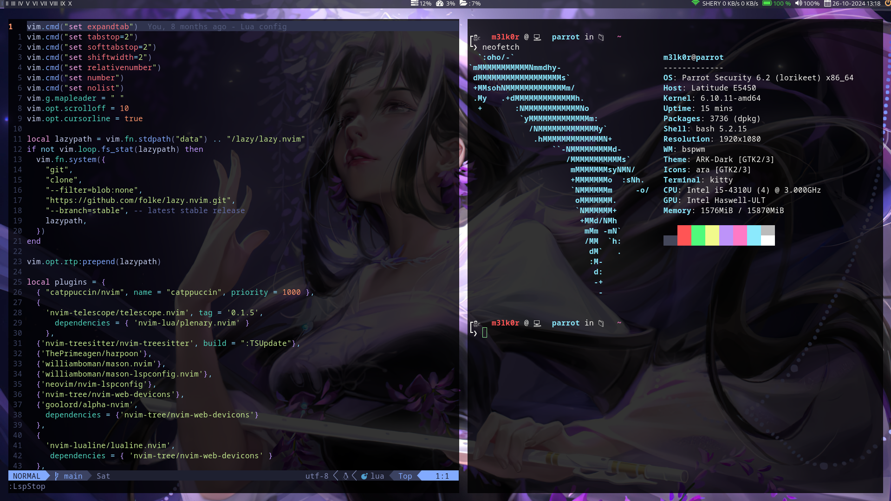

## Customizing Parrot os
Since I daily drive this OS, I decided to use some tiling window manager. Bspwm was the first that came to mind.
I had used tiling wm for the first time on arch (It was i3 and I use arch btw) 😆.

I still do use Arch daily for work though I interchange it with Parrot when I need to put on my security hat.

The motivation for this was I wanted to replicate my same workflows I use on arch on parrot. I have remapped some of my keybindings to be similar to the ones I use in i3 (curse you muscle memory).

Behold:

> P.S. I'm not happy with my polybar...as some wise man once said, "change is gonna come".

**wallpaper from wallhaven.cc**
